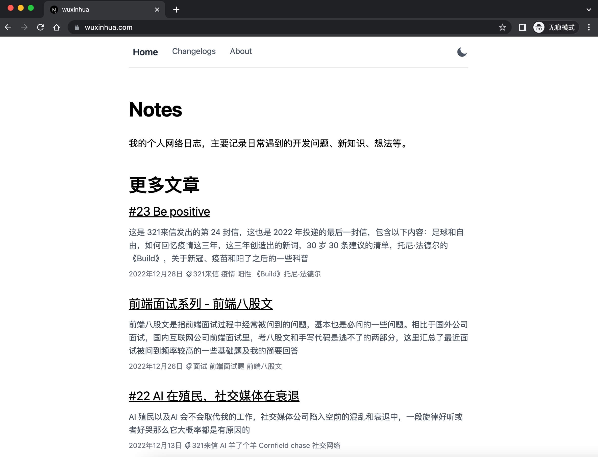

# [wuxinhua.com](https://wuxinhua.com)

My personal Blog using [Next.js](https://nextjs.org/), Markdown, TypeScript, [blog-starter](https://github.com/vercel/next.js/tree/canary/examples/blog-starter) and deploy it to the cloud with [Vercel](https://vercel.com/).



## Feature

- Markdown ✅
- Rss and Sitemap ✅
- Dark mode ✅
- Good SEO([lighthouse performance score](./assets/lighthouse.jpeg) 100 🎉) ✅
- Search ✅

## Structure

- `lib/*` - Short for "library", utils code for external services.
- `scripts/*` - Generate rss and sitemap xml.
- `pages/*` - All static pages.
- `components/*` - Basic ui components.
- `public/*` - Static assets including fonts and images and seo verify file.
- `_posts/*` - All markdown posts.

## Dev

```bash
git clone https://github.com/0xinhua/wuxinhua.com.git my-blog
```

```bash
npm install -g pnpm && cd my-blog && pnpm install
```

```bash
pnpm dev
```

The blog should be up and running on [http://localhost:1024](http://localhost:1024)

## Prod

```bash
pnpm build && pnpm start
```

## MIT License

You can use all the code after removing my personal information and original posts.
