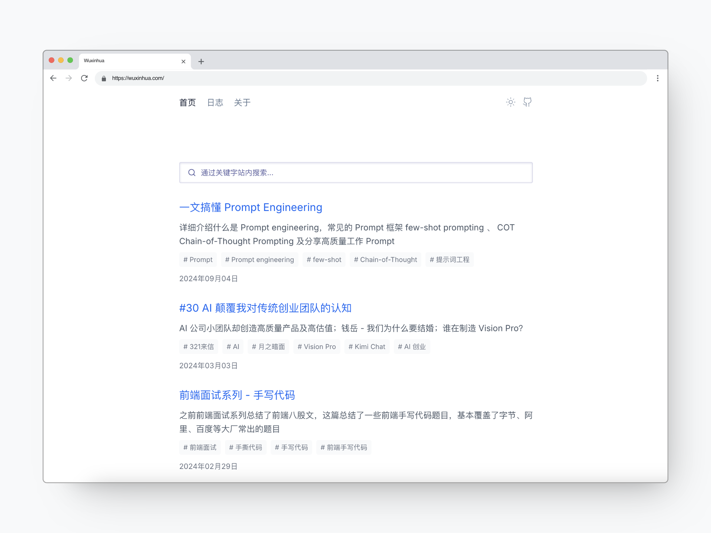

# [wuxinhua.com](https://wuxinhua.com)

- **Framework**: [Next.js 14 App Router](https://nextjs.org/)
- **Deployment**: [Vercel](https://vercel.com)
- **Styling**: [Tailwind CSS](https://tailwindcss.com)
- **Search**: [Algolia](https://www.algolia.com/)

# Deploy

You can use this template to deploy your own blog on vercel with the link below.

[](https://vercel.com/new/clone?repository-url=https%3A%2F%2Fgithub.com%2F0xinhua%2Fwuxinhua.com&project-name=my-blog&repository-name=my-blog&demo-title=wuxinhua.com&demo-description=A%20blog%20site%20created%20with%20Next.js%2014%20by%200xinhua.&demo-url=https%3A%2F%2Fgithub.com%2F0xinhua%2Fwuxinhua.com)

## Feature

- Markdown ✅
- Rss and Sitemap ✅
- Dark mode ✅
- Good SEO([lighthouse performance score](./assets/lighthouse.jpeg) 100 🎉) ✅
- Search ✅

## Structure

- `lib/*` - Short for "library", utils code for external services.
- `scripts/*` - Generate rss and sitemap xml.
- `app/*` - All pages.
- `components/*` - Basic ui components.
- `public/*` - Static assets including fonts and images and seo verify file.
- `_posts/*` - All markdown posts.

## Dev

```bash
git clone https://github.com/0xinhua/wuxinhua.com.git my-blog
```

```bash
npm install -g pnpm && cd my-blog && pnpm install
```

```bash
pnpm dev
```

The blog should be up and running on [http://localhost:1024](http://localhost:1024)

## Prod

```bash
pnpm build && pnpm start
```

## MIT License

You can use all the code after removing my personal information and original posts.
