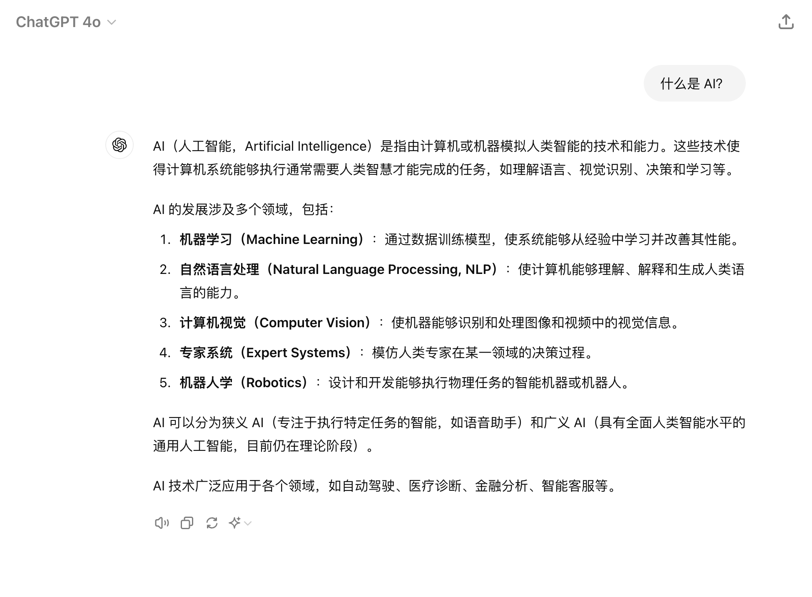
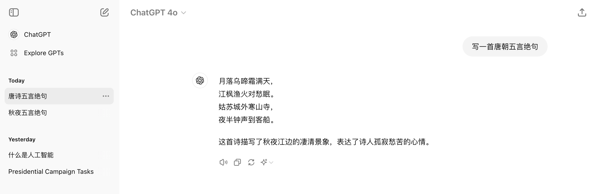
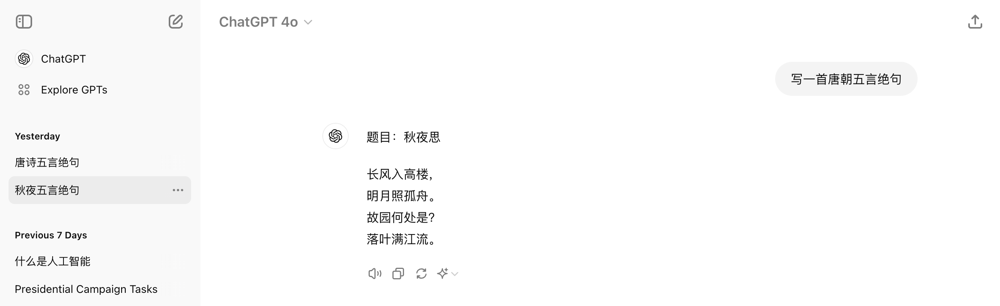
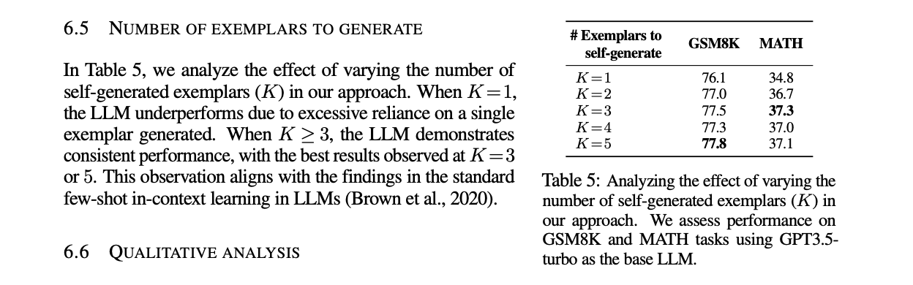
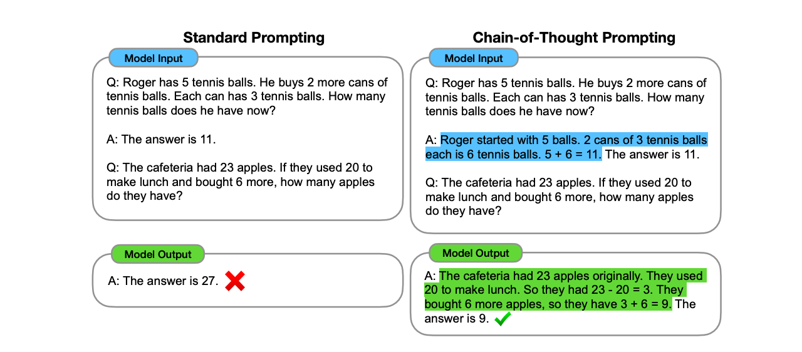

标题 ：what is Prompt engineering and Why Does It Work?

从图灵测试到ChatGPT

“机器能思考吗？” 早在1950年艾伦·图灵尝试去解答这个问题，但这个问题中的“思考”很难定义，图灵直接绕开了它。因为'机器能思考吗？图灵于1950年在他的论文中提出了图灵测试，他选择用另一个替代问题，提出”有没有数字计算机可以在模仿游戏中表现出色？“图灵并没有把他的想法称为“图灵测试”，而是将其称为“模仿游戏”;自从图灵提出了图灵测试以后，它已经成为人工智能哲学中的一个重要概念，以确定一台计算机是否达到了连人类都无法区分人和机器的卓越水平。

图灵测试并不直接测试计算机的行为是否智能，它只测试计算机是否像人一样行为，如果一个人们已经无法准确辨认这是一台机器还是真人的表现，那么这个机器就可以被认为具有人类智能。图灵测试给了 AI 研究一个明确的目标，即让机器在某种程度上表现得像人类。

然而，随着时间的推移，研究者们意识到仅仅模仿人类语言还不足以定义机器智能，即使通过图灵测试，并不能完全展示 AI 的潜力。Prompt Engineering 和图灵测试虽然没有直接联系，但 Prompt Engineering 则展示了另一种可能性，即通过精心设计输入，最大化发挥利用 AI 模型的潜力，让它更像人类一样思考和处理问题，使其输出更符合人类的预期。

- 什么是 Prompt 及 Prompt engineering

什么是 AI 

我们直接来问 ChatGPT 什么是 AI，看下大语言模型是怎么理解 AI 这个概念的

所以 人工智能（AI）的概念最早可以追溯到20世纪50年代，它是计算机科学的一个分支，旨在开发能够执行通常需要人类智慧才能完成的任务的系统或机器。简单来说，AI 就是让机器变得“智能”，能够像人类一样思考、学习和解决问题。

AI 的核心在于模仿人类的思维和决策过程，这通常涉及以下几个关键领域：

机器学习（Machine Learning）: 机器学习是 AI 的基石。它使得计算机能够从数据中学习，而不需要明确编程。通过输入大量的数据，机器学习算法可以识别模式并做出预测，举个例子垃圾邮件过滤器就是通过学习哪些邮件是垃圾邮件来做出判断的，内容推荐系统，机器通过分析学习用户使用习惯和内容消费来推荐内容。

自然语言处理（Natural Language Processing, NLP）:
NLP 使得计算机能够理解、解释和生成人类语言。这项技术在语音助手、翻译工具、聊天机器人等方面得到了广泛应用。NLP 的一个重要方面是语义理解，即不仅识别单词，还要理解其含义和上下文。

计算机视觉（Computer Vision）:
计算机视觉使得机器能够“看见”并理解视觉信息。通过分析图像或视频，例如目前汽车行业都在推出的自动驾驶系统、医疗影像分析等。

提示工程是一门相对较新的学科，旨在开发和优化提示，以高效地使用语言模型（LMs）进行各种应用和研究上，使用提示工程来提高LLMs在各种常见和复杂任务上的能力，这项技能对于与LLMs进行交互、构建应用以及理解它们的能力非常重要。提示工程不仅仅是设计和优化提示词，它涵盖了一系列与LLMs交互和开发所需的技能和技术，例如理解 LLms 的能力、LLMs 的安全性、如何将外部领域的知识和工具增强 LLms 的功能等等。

- 为什么需要 Prompt？how ChatGPT be trained

在生成式 AI 模型中，比如 GPT-3 或 GPT-4o，它们的功能是根据用户输入的提示词来生成文本、代码、图像等。提示词就像是你和 AI 之间的沟通桥梁，决定了 AI 会如何理解你的意图，并生成什么样的内容。

然而，AI 的生成质量往往依赖于提示词的质量。如果提示词模糊、不明确，AI 可能会生成不相关或不符合预期的内容。相反，如果提示词经过精心设计，明确且具体，AI 则更有可能生成符合需求的高质量内容。这种设计和优化提示词的过程，就是 Prompt Engineering。

提示词是你与LLM沟通的方式。

即使大语言模型已经能够帮我们生成各种文本内容，但还是不够好，这与大语言模型背后的原理有关，那么大模型核心系统是什么？

关于ChatGPT的原理其实也比较简单，就藏在它的名字里。ChatGPT 这个名称的全称是 Chat Generative Pre-trained Transformer，chat 指这是一个聊天对话式产品。

G (Generative)，这里的G是指生成。指的是从给定的输入来生成输出，这里的输入可以是我们给的文本，图像或任何其他类型的数据。

P(Pre-Training)预训练，预训练是指使用大量的未标注文本数据来训练ChatGPT模型，预训练模型通常使用互联网的大型语料库来进行训练。

T 指的是“Transformer” 模型。ChatGPT严格意义上来说就是一种基于 Transformer 的自然语言处理模型，采用了预训练 pretraining 及 Fintunning 微调的方法，从而使模型能够适应特定的自然语言处理任务，变成了一个拥有语言理解和文本生成能力的助手。

目前市面上所有的这些语言大模型几乎都是建立在这篇<Attention is all you need >的论文上，这是一篇介绍新的 Tanformer 算法架构的论文，这里我不会深入地去介绍这篇论文，我想以一个日常输入法打字的功能来介绍解释大模型背后的工作原理，你将会很快就理解为什么会需要 prompt 了。当我们日常在输入框打字的时候，例如打出“输”字之后，下面会自动联想建议“入”字，键入“输入”之后，会出现“我”、“输出”、“密码” 等可能键入的字符，你会发现有一些是准确并且可能大概率是我们即将要输入的，例如“输出”、“法”，大语言模型从左到右创造文字内容的过程与这个类似，最大的不同是它不仅仅根据前一个字符推断后一个字符，而是根据整个上下文以及它已有的知识内容（Pre-trained）。

这里以 ChatGPT 为例子，ChatGPT 的训练过程分为两个阶段：

第一阶段：预训练
首先，需要下载大约 10TB 的文本数据，然后获取一个由大约 6000 个GPU组成的集群。接着，将这些文本数据压缩到一个神经网络中，耗资约 200 万美元，并等待大约 12 天，以获得基础模型。

预训练的模型还无法直接使用，它类似于一个大型的互联网文档采样器。Think LLM as kind of mostly inscrutable artifacts 可以把 LLM 想象成最神秘的文物，我们还没法像其它食物一样了解它的原理，预测它的行为。很奇怪的是这些知识不仅仅是存储，你必须通过某个特定的顺序来访问才能得到正确的答复。

第二阶段：微调
编写标注指令，雇佣人员来收集10万个高质量的理想问答数据或对比数据。在这些数据上对基础模型进行微调，等待约1天后，得到助手模型。随后进行大量的评估，部署模型，并持续监控和收集不良行为反馈，若有必要，回到第一步重新开始训练。

由于 GPT4 是闭源模型，我们无法访问权重及获得代码，这里以开源的 llama-2-70b 模型为例，实际上 llama-2-70b 模型只是文件系统上的两个文件，一个是参数文件，另一个是运行这些参数的代码 run.c，如果拿到了这两个文件，并且你的 macbook 能运行 c 语言的这个文件，那么你就在本地拥有了一个 70 亿参数的大模型，所以模型的运行所需的条件是比较简单的，难得是模型的训练部分，也就是这里里 70b 参数，Meta在它的它的论文中介绍了这个训练过程，可以认为是是它爬取了互联网网站的内容，大概 10 TB 文本，然后用了 12 天在 GPU 上把它有损压缩成了一个“zip”文件（并不是真正的zip文件，因为 Zip 文件是无损的，这里的处理是有损压缩），一旦有了这个参数，之后大模型的运行成本变得很低。

"Think LLM as kind of mostly inscrutable artifacts."

大模型以机器学习为核心，在技术上产生一种新的模仿形式——对数据的模仿，但这个模仿并不是精准的。提示词是你与 LLM 沟通的方式，它用来告诉模型你想让它做什么。

例如当我让 ChatGPT 写一首唐朝的五言绝句时，同样的问题它给了不同答案，所以你可以看到 ChatGPT 貌似是一个概率系统，你提出一个提示问题，它可以提供多种答案来回复。准确的来说第二个答案会更好一些，因为ChatGPT 它正确的理解我的意图，从新创造了一首新的诗，并且写得还不错，它准确的依照了唐代的五言绝句风格：四句，每句五个字，押韵上虽然不是很完美，但背后表达的意义却很丰富，并且可以很明显是在模仿李白的静夜思。

大语言模型准确地模拟了单词、句子、符号的位置，并且知道哪些词在中文语境里是可以组合到一起的，其实它是在完成一个序列，根据给的提示词准确的预测下一个单词并且拼接成句子系列。之所以第一个答案不是很准确是因为它预测错了我的意图：它以为我想让它找出并解释一首五言绝句。

- 几个基础概念
  - Temperature
  - System Prompts 

1. 清晰是关键

清晰和明确的提示是成功的关键。尽量使用通俗易懂的语言，确保 AI 模型可以准确理解你的需求。避免使用多义词或模糊的表达，尤其是在专业领域中，除非这些术语在特定的上下文中不可避免。在编写 prompt 时，最好假设模型是一个高效但需要明确指令的助手。通过增加具体的细节和说明，你可以更好地引导模型生成符合预期的结果。

示例：

模糊的提示：“描述一款产品。”
清晰的提示：“描述一款适合日常使用的无线蓝牙耳机，强调音质和续航时间。”

2. 角色扮演

角色扮演是增强 prompt 效果的有力工具。通过赋予 AI 模型一个具体的角色或身份，可以帮助它更好地理解上下文并生成符合预期的响应。例如，你可以让模型扮演某个行业专家、虚构人物或者特定的职业角色。这样可以为输出设定一个更精确的语境。

示例：

指定角色：“作为一个经验丰富的市场营销经理，撰写一封推销新产品的电子邮件。”
非角色提示：“写一封推销电子邮件。”

示例:

指定角色：“我今天心情很低落，假装你是我的女朋友用温柔的语气安慰我，让我感觉好一些。”
非角色提示：“我今天心情很低落，用温柔的语气安慰我”

3. 使用特殊字符当分隔符

使用特殊字符（如 ### 或 ===）或 XML 标签来分隔内容，有助于模型更好地理解和组织信息。这在长文本或复杂指令中尤为重要。选择合适的分隔符取决于上下文和复杂性，但一定要确保这些分隔符足够独特，避免与常规文本混淆。

示例：

使用特殊符号：“生成以下内容的摘要：### 段落 1 ### 段落 2 ### 段落 3”
使用 XML 标签：“
生成以下内容的摘要：
<content>段落 1</content><content>段落 2</content><content>段落 3</content>”
4. 反复迭代
在生成和优化 prompt 时，反复迭代是一个至关重要的过程。初始版本的 prompt 可能不会产生理想的结果，因此需要根据输出进行调整和优化。通过不断迭代，你可以逐步改进 prompt，使其更贴合你的需求和标准。

步骤：

- 起草初始 prompt。
使用 AI 模型生成响应。
评估输出结果是否符合意图。
调整 prompt 内容，增强或修正不符合预期的部分。
重复上述步骤，直到得到理想的输出。
提示：
在每次迭代中，注意记录 prompt 的变化和对应的输出结果。这不仅有助于理解调整的效果，还能为未来类似的任务提供有用的参考。

5. 增加提示的上下文
在某些情况下，增加提示的背景信息可以显著提升模型的输出质量。通过提供更多相关信息，你可以让模型更全面地理解任务要求，从而生成更加精确的响应。

示例：

提供上下文：“假设你正在为一家初创科技公司撰写博客文章。描述一篇关于最新 AI 技术发展的文章。”

prompting 框架

- few-shot prompting

从大语言模型 (LLM) 获取更好输出的最佳方法之一是在提示中包含示例。这种方法称为少样本提示 (few-shot prompting)（“样本”是一个示例）。通过提供示例，向模型清楚地展示你所希望的输出结构、语气和风格。

个数以及顺序会影响响应质量吗？

关于使用多少个例子最合适，论文中的实验结果表明，自动生成 3 到 5 个例子（K=3 到 5）在各种任务中表现最好，增加更多的示例不一定能提高准确性；在某些情况下，反而可能会降低准确性。多项研究表明，在提供两个示例后，模型性能会显著提升，然后趋于一个稳定的水平。所以说越多的示例并不代表更好的答案，示例越多意味着你需要耗费更多的 Token。

COT Chain-of-Thought Prompting

思维链式提示是一种引导LLMs在处理难题时遵循推理过程的技术。通过向模型展示一些示例来实现的，其中一步一步的推理都是清晰的。然后，该模型被期望遵循 COT 的推理并得到正确的答案。下面是一个例子：

和 few shots 有点类似，都是给一些示例让大模型知道该如何处理及给出答案，但不同的点在于 few shots 是给一些正确的或用户期望的例子，而 COT 则是使用例子给大模型展示这个推理的过程，不仅仅是答案。

什么时候使用？

CoT是常见的场景是模型需要理解并遵循一些中间步骤才能得到正确答案时，例如当你的任务涉及到需要算术、常识解释和复杂推理时。

- 用 CO-STAR 框架来提升你的 Prompt 提示词质量。🚀

这是我最近学到的很有用一个优化 Prompt 框架及技巧。

它来自 Sheila Teo 的一篇文章，作者在新加坡首届 GPT-4 提示工程大赛中脱颖而出，战胜了超过 400 名优秀参赛者，荣获提示词大赛冠军！ 她在文章中详细介绍了她是如何运用了创新的 CO-STAR 框架来构建高效的提示，充分发挥大语言模型的潜力。

CO-STAR 分别代表：

- Context 上下文: 提供背景信息。
- Objective 目标: 清晰定义任务。
- Style 风格: 指定写作风格。
- Tone 语气: 设置情感基调。
- Audience 受众: 确定目标受众。
- Response 响应: 确定输出格式。

通过综合考虑这些因素，CO-STAR 框架能够帮助用户构建更加有效的提示，从而获得更加精准和相关的AI响应，你也可以尝试使用这一框架来提升您的 AI 交互体验。

例如这是一个我使用 CO-STAR 框架写的一个 prompt 例子：

将长文章内容转化为推文和社交媒体内容的 Prompt 示例：

You are tasked with converting an article into two social media posts: an English short social media content for twitter and a Chinese social media post. here is some rules guide your content creation.

Context: You are a social media content creator working for a multinational company that publishes content in both English and simplified Chinese.

Objective: Create two engaging social media posts based on the provided article content - one in English and one in Chinese.

Style: For both posts, use a concise, engaging, and informative style suitable for social media platforms. The English post should be casual and friendly, while the Chinese post should be slightly more formal but still approachable.

Tone: The English post should be enthusiastic and conversational. The Chinese post should be respectful and informative.

Audience:
- For the English post: Young to middle-aged adults who are active on social media and interested in staying informed about current events and trends.
- For the Chinese post: Chinese-speaking professionals and students who use social media for both personal and professional networking.

Response: Please provide your output in the following format:
<english_post>
[Your English social media short here]
</english_post>

<chinese_post>
[Your Chinese social media post here]
</chinese_post>

Instructions for creating the English social media short:
1. Summarize the key points of the article in a concise and engaging manner.
2. Use simple language and avoid jargon.
3. Pay attention to narrative method and for example you can tell the story in the third person.
4. Include a hook or interesting fact to grab the reader's attention.
5. If appropriate, add a relevant accurate and common hashtag or call-to-action.
6. Ensure the post does not exceed 280 words.

Instructions for creating the Chinese social media post:
1. Translate and adapt the key points of the article for a Chinese-speaking audience.
2. Use formal Chinese language, but maintain a friendly tone.
3. Pay attention to the narrative, for example, you can tell the story in the third person to make the content more engaging.
3. Include any culturally relevant references or idioms if appropriate.
4. Adapt any Western concepts or references to be more familiar to a Chinese audience.
5. Ensure the post does not exceed 3000 characters.

Remember to stay true to the original content while adapting it for each specific audience and platform. Provide your English and Chinese posts within the specified tags.

Here is the article content to work with:

- some soecific prompts